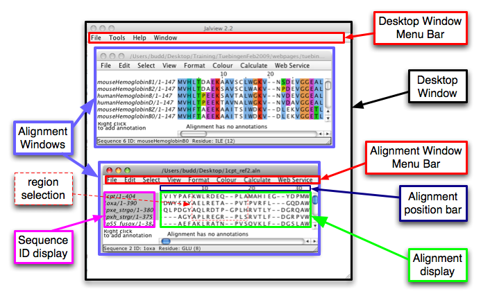
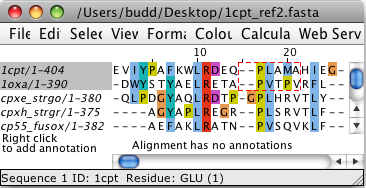
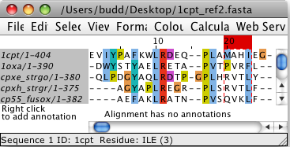

# Using Jalview

------------------------------------------------------------------------

- [Introduction](#Introduction)
- [Online documentation and tutorials](#Online_documentation_and_tutorials)
- [Getting Jalview](#Getting_JalView_)
- [Overview of the Jalview Graphical User Interface (GUI)](#Overview_of_Jalview_GUI)
- [Starting Jalview - removing automatically-opened windows](#Starting_Jalview_-_removing_)
- [Opening an alignment in Jalview](#Opening_an_alignment_in_JalView)
- [Saving an MSA to a local file](#Saving_an_MSA_to_a_local_file)
- [Adjust MSA display options - wrapping the alignment, changing the colouring scheme](#Adjust_MSA_display_options)
- [Creating region selections](#Creating_region_selections)
- [Selecting entire/complete sequences](#Selecting_entirecomplete_sequences)
- [Selecting alignment columns](#Selecting_alignment_columns)
- [Removing/deleting regions of an MSA](#Removingdelecting_regions_of_an_MSA) - particularly columns to be excluded from a phylogenetic analysis
- [Inserting/removing gaps in an MSA](#Insertingremoving_gaps_in_an_MSA)
- [Changing the order of sequences in an alignment](#Changing_the_order_of_sequences_in_an)
- [De-selecting all selected regions/columns/sequences](#Deselecting_all_selected_regionscolumnssequences)
- [Undo](#Undo_function)[!](#Undo_function)
- [Adjusting Jalview default settings](#Adjusting_Jalview_Default_Settings)

------------------------------------------------------------------------

### Introduction

Jalview is primarily a multiple sequence alignment (MSA) editor - however it additionally provides a wide range of additional tools and features that supplement and support the interpretation of an MSA.

In these notes, however, we will be focusing on using Jalview to edit and manipulate MSAs, rather than on the extensive additional functionality it provides.

### Online documentation and tutorials

The [Jalview website](http://www.jalview.org/index.html) provides several different documents and pages that provide useful information and documentation on using the tool. Particularly useful are:

[a quick-references guide to using Jalview as an alignment editor](http://www.jalview.org/examples/editing.html) - i.e. using Jalview to insert/remove gaps in an alignment

- this is so useful that we've stored a [copy of the page here](webpages/jalviewEditing.html), in case the Jalview site is having problems during our teaching

[a quick-reference card in PDF format](http://www.jalview.org/refcard.pdf) describing and labeling the different features and regions of the Jalview Graphical User Interface (GUI) - again, [here is a local copy of the card](images/refcard.pdf) in case there are problems with the Jalview site

[the Jalview online documentation](http://www.jalview.org/help.html) - provides a detailed description of Jalview's many features and options

[PDF of an extensive manual and tutorial](http://www.jalview.org/tutorial/TheJalviewTutorial_screen.pdf) provided by the Jalview team

### Getting Jalview

Jalview can be [downloaded here](http://www.jalview.org/) from the University of Dundee.

### Overview of the Jalview Graphical User Interface (GUI)

Within a session of Jalview you can open more than one alignment, each alignment displayed and manipulated in its own **Alignment Window**.

The alignment itself is displayed within the **Alignment display**.

Different columns in the alignment are specified by numbers describing their position with respect to the first column in the alignment (which is position 1). The **Alignment position bar** indicates the position of the columns currently shown in the **Alignment display**. This bar is also used to select ranges of columns in the alignment, and to indicate columns in the alignment that have been selected.

The identifiers associated with the sequences shown in the **Alignment display** are shown in the **Sequence ID display**. Clicking on identifiers in this display can be used to select entire sequences.

Clicking and dragging within the **Alignment display** will define a **region selection** (outlined in dashed red lines) - specific analyses can be applied to such a region, or the region can be used to restrict edits to given region of the alignment.

These **Alignment Windows** are displayed within the **Desktop Window**. Other kinds of windows (e.g. displaying protein 3D structures) will also appear within the **Desktop Window** - however, we will only be working with **Alignment Windows**.

Both the **Alignment Window** and the **Desktop Window** are associated with **Menu Bars**. Note that the menus available on the bars of the different types of window are also different - for example, only the **Alignment Window** contains an **Edit Menu**, the **Desktop Window** doesn't have such a menu.

If you are working with only one alignment, you might want to maximise its **Alignment Window** to fill the **Desktop Window** using the "Maximise" button (on a Macintosh machine, this will be a green button that shows a "+" sign on mouse-over at the top left of the window).

Taken as a screenshot from a Macintosh machine, the image below shows one Jalview Desktop Window within which two Alignment Windows are open. Both Alignment Windows have an Alignment Display, Alignment position bar, Sequence ID display, and a Menu Bar, but these are only labeled on the lower of the two Alignment Windows.

Additionally, a region selection has been made on the lower alignment, outlined in thin dashed red lines.

### Starting Jalview - removing automatically-opened windows

On some installations of Jalview, the software is set up to automatically load a specified set of files on executing Jalview.

These example files can provide a useful overview of the features
available in Jalview - however, they can also take quite some time to
load, which is not ideal if you are not interested in exploring the
examples.

If this happens, you can remove all these windows using:

> *Desktop Window-&gt;Window-&gt;Close All*

You can also specify the [default settings of the software (#Adjusting_Jalview_Default_Settings)e to deselect the option that causes these files to open automatically on starting the software:

1.  *Desktop Window-&gt;Tools-&gt;Preferences-&gt;Visual tab*
2.  Deselect the tick in the "Open file" box at the bottom of the window

### Opening an alignment in Jalview

To open an alignment file stored on your local filesystem:

> *Desktop Window-&gt;File-&gt;Input Alignment-&gt;From File*\

Note that, by default, Jalview searches only for Jalview .jar-format files - if your alignment/sequences are in some other format, you will need to specify either the relevant format using the File Format drop-down list in the Open local file window, or indicate that you want to have access to All Files.

### Saving an MSA to a local file

Selecting the Menu Bar from the Alignment Window whose alignment you want to save:

> *Alignment Window-&gt;File-&gt;Save As...*

Specify the format of the output file using the "File Format' drop-down box.

If you have made modifications to the appearance of the alignment that you want to preserve for a later session of Jalview, then select the Jalview .jar format. When re-loaded into a later session of Jalview, this should preserve any sequence annotation, formating, etc you might have added to the alignment.

Note that, by default, Jalview appends information about the start and end position of the residues from a sequence that are included in the output file.

In many contexts it is useful to provide this information in the sequence identifier - however, for some software that you might provide your Jalview alignment as input for, the additional characters that this adds to the identifier cause the identifier line to be too longer, and the inclusion of a "/" in the identifier may prevent some software from reading the alignment as input.

To turn this feature off (by default) do the following:

1.  *Desktop Window-&gt; Tools-&gt;Preferences...-&gt;Output Tab*
2.  In the "File Output" zone of the window, remove the checks from the
    boxes next to the names of the different formats available

### Adjust MSA display options - wrapping the alignment, changing the colouring scheme

By default, the alignment is displayed in one row - however, some users prefer to examine the alignment wrapped within the alignment window. This is also useful when using Jalview to preparing alignments for use in figures.

To wrap the alignment, select the menu for the Alignment Window containing your alignment, and use the following menu option:

> *Alignment Window-&gt;Format-&gt;Wrap*

By default, the alignments displayed in Jalview are uncoloured.\

To apply a colouring scheme to the alignment - for example the default CLUSTALX scheme:

> *Alignment Window-&gt;Colour*

and then select your colouring scheme of choice.

### Creating region selections

Left click on either the top or bottom left residue you want to include in the region selection, and drag the mouse to the residue at the opposite corner of the region you want to select.

**Note that this does not work if you begin at the top or bottom right of the region!!** You will not be able to extend the selection (at least using your initial mouse-drag) to the left of your initially-selected residue!!

The region selection is bordered by a dashed red line.

Once initially created, the boundaries of the region selection can be modified by clicking on one of the borders and dragging to the desired position. However, be careful to click fairly precisely on the dashed red line border - otherwise you will remove the initial region selection and be creating a new one instead!

[This image](#region_selection_image) shows a small region selection.

### Selecting entire/complete sequences

You can directly select a set of sequences by left-clicking on their respective sequence identifiers in the Sequence ID display.

- Hold down CTRL to select additional sequences by clicking on the corresponding sequence identifiers.
- Once more than one sequence is selected, hold down SHIFT to select multiple additional sequences.

Sequences are also selected when you [create a region selection](#Creating_region_selections) - this selects the set of sequences whose residues are included in the region selection.

The identifiers of selected sequences are shaded grey in the Sequence ID display - for example, in the image below, the sequences **1cpt** and **1oxa** have been selected, due to the creation of a region selection (the region enclosed in dashed red lines).

### Selecting alignment columns

Left-click and drag with the mouse in the Alignment position bar above the Alignment display to select the columns.

Hold down CTRL to select additional columns.

Once more than one column has been selected, hold down SHIFT and click on another column to select all columns that lie between the left- and right-most selected columns (including the column selected using SHIFT)

For example, in the image below, columns 20 - 23 have been selected.

### De-selecting all selected regions/columns/sequences

To de-select all selections, use either:

- press the "Escape" key
- *Alignment Window-&gt;Select-&gt;Deselect all*

### Removing/deleting regions of an MSA - particularly columns to be excluded from a phylogenetic analysis

When preparing an alignment for use in a phylogenetic analysis, typically some columns are excluded from the analysis - as they are suspected of containing residues from different sequences that are not related by point substitution events.

This can be done automatically, for example using the [GBLOCKS software](http://molevol.cmima.csic.es/castresana/Gblocks_server.html).

Alternatively, columns to be excluded from the analysis can be selected "by eye" - this process can be aided by using the [CLUSTALX Show Low-Scoring
Segments](http://www.embl-heidelberg.de/%7Eseqanal/courses/commonCourseContent/usingClustalx.html) feature to identify regions that likely contain such misalignments.

To remove columns from an alignment using Jalview, [select the columns you want to remove](#Selecting_alignment_columns) and then either:

- press the "Delete" or "Backspace" key to remove the columns
- *Alignment Window-&gt;Edit-&gt;Cut*

The same two actions described above can also be used to delete any other kinds of selections from the alignment i.e. both selected sequences or regions selections can be removed in this way.

### Inserting/removing gaps in an MSA

Two situations in which you might want to manually adjust/edit an alignment are:

- having identified regions of an alignment that could be improved by manual adjustment/editing
- having calculated an alignment between using other methods (e.g. using 3D structural comparison) that you want to incorporate in an alignment

Adjusting/editing an alignment is "simply" an exercise in adding or removing gap characters from the alignment.

Jalview provides several different ways of introducing gaps into an alignment, as summarised on this [help page](http://www.jalview.org/examples/editing.html).

To add gaps from a position in an alignment:

- Begin by pressing (and keeping pressed) the SHIFT key
- Left-click on the position you want to insert the gap, and drag to the right of this position (while keeping the SHIFT key held down)

To remove gaps from a position in an alignment:

- Begin by pressing (and keeping pressed) the SHIFT key
- Left-click on the gap you want to remove, and drag to the left of this position (while keeping the SHIFT key held down)

To add/remove gaps to several positions in an alignment at the same time:

- [Select multiple sequences from the alignment](#Selecting_entirecomplete_sequences)
- Press (and keep pressed) the CTRL key
- Left click at the appropriate position, and drag to the right (to add gaps) or to the left (to remove gaps) (while keeping the CTRL key held down)

Note that, while several sequences are selected, you can still add/remove gaps from a single sequence by holding down the SHIFT rather than the CTRL key.

### Changing the order of sequences in an alignment

[Select a set of sequences.](#Selecting_entirecomplete_sequences)

Use the up and down arrow keys to move the set of selected sequences up and down within the alignment.

### Undo function

Unlike many other MSA software (e.g. SEAVIEW or CLUSTALX), Jalview provides an invaluable "Undo" function. Invaluable because, without it, an alignment you have been editing for hours might, by accident, be partially deleted, adjusted, etc. in a way that would (without "Undo" being available) mean having to start again from scratch - something we're all keen to avoid.

Exactly as in typical office software, this will undo the previous action you have carried out on the alignment. Additionally, this can be carried out several times, so that you can undo a set of changes introduced one after the other. To use this feature do:

> *Alignment Window-&gt;Edit-&gt;Undo*

### Adjusting Jalview Default Settings

There are many features of the Jalview interface that can be specified as new defaults by the user such that, after changing these settings, they will be preserved and used after the current Jalview session has been closed and a new one started. To adjust these settings use the following menu:

> *Desktop Window-&gt;Tools-&gt;Preferences*

For example, this can be used to specify:

- a default colouring scheme for newly-opened alignments
- whether or not sequence identifiers in the various output alignment formats are annotated with the start-end positions of each sequence
